<!--
=====================================================================
  SETUP (2 minutes)
  1. Create a NEW public repo named EXACTLY: abdessamed-britah
     (repo path becomes abdessamed-britah/abdessamed-britah)
  2. Add this file as README.md
  3. Everything is already filled in with your details.
     Optional: add repo links in "Featured Projects" and a boxing GIF.
  4. Commit. Your profile shows it automatically.
=====================================================================
-->

<!-- ===================== HEADER BANNER ===================== -->
<!-- Custom banner (name baked in). Keep banner.svg in this repo's root.
     Eyes glow and embers drift on their own — no setup needed. -->

  

<!-- Itachi GIF under the name. Keep anime.gif in this repo's root.
     Because the file lives in your repo, it can't break like a hotlink can. -->

  

<!-- ===================== INTRO ===================== -->
### 🛡️ About Me

Data Science &amp; AI engineering student at Algeria's **National Polytechnic School (ENP)**, focused on **AI security and trustworthy ML**. I build systems that hold up under pressure — adversarial robustness, liveness detection, and guardrails that validate before an LLM agent does anything sensitive.

Same discipline in the ring and in the repo: guard up, keep good form, outwork yesterday. 🥊

- 🔭 Building **Agent-Runner** — a reproducible benchmark for LLM-agent safety &amp; prompt-injection defense
- 🛡️ Into **adversarial robustness, anti-spoofing, and secure ML pipelines**
- 🎓 Industrial Engineering (Data Science &amp; AI) @ **ENP**, Algiers
- 🥊 Boxer when I'm off the keyboard — every model looks robust until it meets an adversary
- 📫 **abdessamed.britah@g.enp.edu.dz**

<!-- Optional boxing GIF: uncomment the next line and drop a file named
     boxing.gif in this repo, or paste any direct .gif link as the src.

-->

<!-- ===================== SOCIAL BADGES ===================== -->

 

<!-- ===================== TECH STACK ===================== -->
## 🛠️ Tech Stack

**AI / ML**

**Languages**

**Data &amp; Backend**

**Tools**

 

<!-- ===================== FEATURED PROJECTS ===================== -->
##  Featured Projects

> Add the real repo links where you see `#` once the repos are public.

**🛡️ [Agent-Runner](#) — LLM-Agent Safety Benchmark (FR/AR)**
Reproducible protocol measuring cost, quality, and safety across agent configs (model, RAG, guardrail validation before sensitive actions). 40-task benchmark · 320 multi-provider runs · 80 automated tests.
`Python` · `FastAPI` · `PostgreSQL/pgvector` · `ReAct agents`

**🖼️ [DLL-GAN](#) — Image Restoration, Reimplemented from Scratch**
Rebuilt an unreleased published GAN in PyTorch, then fixed two flaws in the original method (an exploitable unbounded degradation loss + checkerboard artifacts via resize-convolution). Full DIV2K training &amp; PSNR/SSIM pipeline.
`PyTorch` · `DIV2K` · `Public documented repo`

**📈 [Oil Price Prediction](#) — Geopolitical Signals + Big Data**
Real-time Spark/Hadoop pipeline modeling geopolitical events against oil-price movements.

 

<!-- ===================== GITHUB STATS ===================== -->
## 📊 GitHub Stats

 

 

<!-- Crow interstitial (ties into the Itachi theme). Keep giphy.gif in this repo's root
     so it can't break like a hotlink. -->

  

<!-- ===================== CONTRIBUTION GRAPH ===================== -->
##  Contribution Activity

<!-- Pac-Man eats your REAL contribution squares while ghosts chase him.
     Self-updates daily via .github/workflows/pacman.yml.
     Stays blank until that action runs successfully once. -->

  <picture>
    <source media="(prefers-color-scheme: dark)" srcset="https://raw.githubusercontent.com/abdessamed-britah/abdessamed-britah/output/pacman-contribution-graph-dark.svg" />
    <source media="(prefers-color-scheme: light)" srcset="https://raw.githubusercontent.com/abdessamed-britah/abdessamed-britah/output/pacman-contribution-graph.svg" />
    
  </picture>

 

<!-- Activity timeline (line graph) -->

 

<!-- ===================== TROPHIES ===================== -->

  <i>Every model looks robust until it meets an adversary. 🥊 Guard up.</i>
    
  

